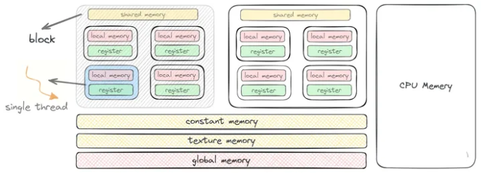

# CUDA程序加速关键
1.数据传输比例
GPU计算核心和设备内存之间的数据传输带宽远高于CPU到GPU传输带宽，想获得客观的GPU加速，就先必须尽量缩减数量传输所花的时间比例。

2.核函数内的计算强度和访存时间
计算强度大，理应是效率高的加速；算数操作工作量与必要的内存操作的工作量（时间）之比。方法：减少访存操作次数，通过共享内存、寄存器内存等内存结构合理使用降低访存操作次数

3.SM驻留线程和并行规模
影响SM中驻留线程数主要原因：并行规模，分配每个SM的线程数量太少，SM占有率低，不能激发GPU最大性能。
资源限制。每个SM都有资源限制。每个 SM 都具有一定数量的寄存器、共享内存等资源，当我们在核函数中使用这些资源超过一定量时（单个线程使用量超标），SM 就不得不减少其内部驻留的线程数。

SM 总资源 = 单个线程占有资源数 * SM中线程数量

# CUDA内存组织

1.CUDA内存结构
GPU中的内存具有高延时高吞吐的特性，不同内存的可见范围和访问速度（绿色最快，黄色次之，红色最慢）

 http://www.uml.org.cn/Computer/202404164.asp

学习链接 ：https://face2ai.com/program-blog/#GPU%E7%BC%96%E7%A8%8B%EF%BC%88CUDA%EF%BC%89