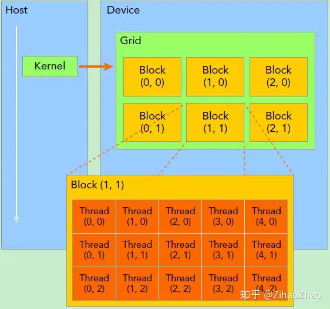
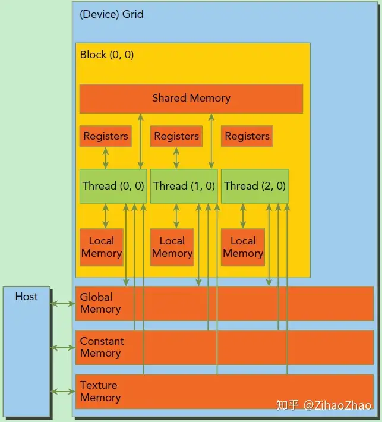
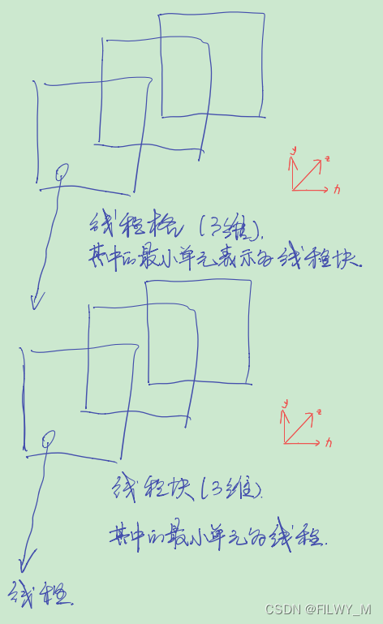
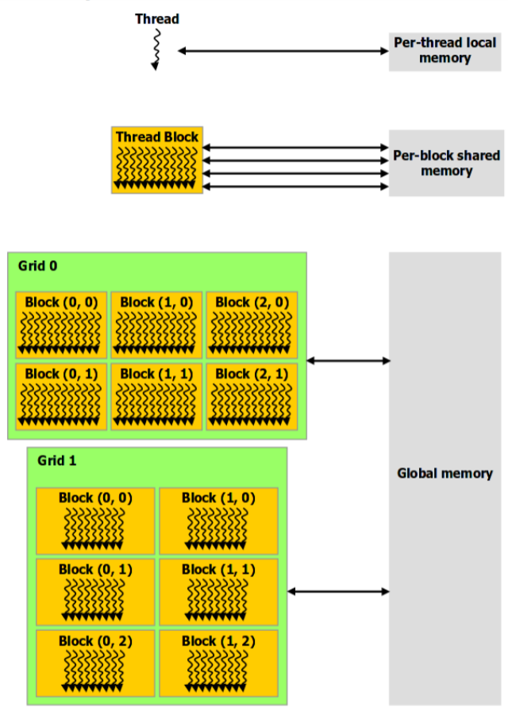
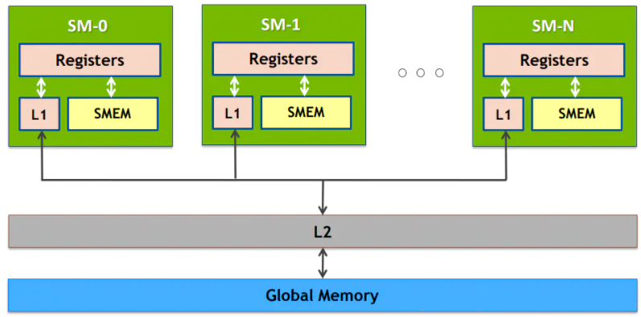

# 苏统华教程

## CUDA编程模型 SIMT（Single Instruction Mutiple Threads）

本文作为系列的第一篇，主要是从软件层面介绍一些CUDA编程的基本概念。

CUDA是一种通用的并行计算平台和编程模型，是在C语言基础上扩展的。

CUDA编程模型假设系统是由一个主机（CPU）和一个设备（GPU）组成的，而且各自拥有独立的内存。而我们作为程序员，需要做的就是编写运行在主机和设备上的代码，并且根据代码的需要为主机和设备分配内存空间以及拷贝数据。而其中，运行在设备上的代码，我们一般称之为**核函数（Kernel）**，核函数将会由**大量硬件线程并行执行**。

一个典型的CUDA程序是按这样的步骤执行的：

1. 把数据从CPU内存拷贝到GPU内存。
2. 调用核函数对存储在GPU内存中的数据进行操作的。
3. 将数据从GPU内存传送回CPU内存。

CUDA编程模型有两个特色功能，一是通过一种**层次结构来组织线程**，二是通过**层次结构来组织内存**的访问。这两点和我们平时CPU编程是有较大区别的。

先说第一点，一般CPU一个核只支持一到两个硬件线程，而GPU往往在硬件层面上就支持同时成百上千个并发线程。不过这也要求我们在GPU编程中更加高效地管理这些线程，以达到更高的运行效率。在CUDA编程中，线程是通过**线程网格（Grid）、线程块（Block）、线程束（Warp）、线程（Thread）**这几个层次进行管理的，后面我们会详细讲到。

再说第二点，为了达到更高的效率，在CUDA编程中我们需要格外关注内存的使用。与CPU编程不同，GPU中的各级缓存以及各种内存是可以软件控制的，在编程时我们可以手动指定变量存储的位置。**具体而言，这些内存包括寄存器、共享内存、常量内存、全局内存等。**这就造成了CUDA编程中有很多内存使用的小技巧，比如我们要尽量使用寄存器，尽量将数据声明为局部变量。而当存在着数据的重复利用时，可以把数据存放在共享内存里。而对于全局内存，我们需要注意用一种合理的方式来进行数据的合并访问，以尽量减少设备对内存子系统再次发出访问操作的次数。

下面我们详细说说线程管理和内存管理这两点。

## cuda抽象机制

### 线程模型

首先我们需要了解线程是如何组织的，下面这幅图比较清晰地表示出了线程的组织结构。当核函数在主机端启动时，其执行会移动到设备上，此时设备中会产生大量的线程并且每个线程都执行由核函数指定的语句。




由一个内核启动所产生的所有线程统称一个网格（Grid），同一网格中的所有线程共享相同的全局内存空间。向下一级，一个网格由多个线程块（Block）构成。再下一级，一个线程块由一组线程（Thread）构成。**线程网格和线程块从逻辑上代表了一个核函数的线程层次结构，这种组织方式可以帮助我们有效地利用资源，优化性能。**CUDA编程中，我们可以组织三维的线程网格和线程块，具体如何组织，一般是和我们需要处理的数据有关。上面这个示意图展示的是一个包含二维线程块的二维线程网格。

> addKernal<<<1,128>>>(dev_c, dev_a,dev_b);		//该语句使用了1个block，每个block有128个thread来组成Grid

### 内存模型

CUDA编程另一个显著的特点就是解释了内存层次结构，每一个GPU设备都会有用于不同用途的存储类型。




GPU内存层次结构

上图描绘了各种内存空间的层次结构，看不太懂没有关系，我们只需先关注这三种内存类型：寄存器（Registers）、共享内存（Shared Memory）和全局内存（Global Memory）。

其中**寄存器是GPU上运行速度最快的内存空间**，通常其带宽为8TB/s左右，延迟为1个时钟周期。核函数中声明的一个没有其他修饰符的自变量，通常就存储在寄存器中。最快速也最受偏爱的存储器就是设备中的寄存器，属于具有重要价值有极度缺乏的资源。

接下来是共享内存，**共享内存是GPU上可受用户控制的一级缓存**。共享内存类似于CPU的缓存，不过与CPU的缓存不同，GPU的共享内存可以有CUDA内核直接编程控制。由于共享内存是片上内存，所以与全局内存相比，它具有更高的带宽与更低的延迟，通常其带宽为1.5TB/s左右，延迟为1～32个时钟周期。对于共享内存的使用，主要考虑数据的重用性。**当存在着数据的重复利用时，使用共享内存是比较合适的。**如果数据不被重用，则直接将数据从全局内存或常量内存读入寄存器即可。

**全局内存是GPU中最大、延迟最高并且最常使用的内存。**全局内存类似于CPU的系统内存。**在编程中对全局内存访问的优化以最大化程度提高全局内存的数据吞吐量是十分重要的**。

纹理内存--------------------

CUDA给编程者提供了这些可以操作的GPU内存层次结构，这对我们进行数据移动和布局提供了更多可控制的支持，方便了我们以更接近底层硬件实现的思路优化程序，以达到更高的性能。这也是CUDA编程不同于CPU编程的特点之一。


## 内核执行

### CUDA函数

CUDA函数分为三个类型，device、kernel、host

| 语法                              | 执行设备   | 调用设备         |
| --------------------------------- | ---------- | ---------------- |
| \_\_device\_\_ float DeviceFunc() | **device** | **device**       |
| \_\_global\_\_ void KenelFunc()   | **device** | **host、device** |
| \_\_host\_\_ float HostFunc()     | **host**   | **host**         |

### 线程索引



一、3维线程格,其中的最小单元表示线程块；3维线程块,其中最小单元为线程

二、GridDim、BlockDim、BlockIdx、ThreadIdx

1.假设线程格是一个3*4*5三位矩阵，线程块是4*5*6
GridDim.x = 3 ,GridDim.y = 4,GridDim.z  = 5;BlockDim.x = 4,BlockDim.y = 5,BlockDim.z =6

3.blockIdx.x、blockIdx.y、blockIdx.z分别表示当前线程块所处的线程格的坐标位置

4.threadIdx.x、threadIdx.y、threadIdx.z分别表示当前线程所处的线程块的坐标位置

三、如何定位一个坐标？
1.线程格里面总的线程个数N，N = (GridDim.x*GridDim.y*GridDim.z)*blockDim.x*blockDim.y*blockDim.z

2.先找到当前线程位于线程格中的哪一个线程块BlockId
blockId = blockIdx.x + blockIdx.y * gridDim.x + blockIdx.z * (gridDim.x * gridDim.y);

3.找到当前线程位于线程块中的哪一线程threadId
threadId = threadIdx.x + threadIdx.y*blockDim.x + threadIdx.z*(blockDim.x * blockDim.y);

4.计算一个线程块中一共有多少线程
M = blockDim.x * blockDim.y * blockDim.z;

5.求当前线程序列号(全局)idx
idx = threadId + blockId*M

### block_size和threads_size设置对性能的影响
//todo ，补充

## 线程调度约束机制

cuda中kernel函数会将整个grid交付于GPU执行，而GPU则会根据自身SM（streaming Multiprocessor）空闲的数量来依次执行grid中的各个block；

是SM是GPU的基本执行单元，负责执行指令和处理数据.（SM意味着吞吐量，自动扶梯1分钟运60人，就要保证扶梯上同一时间有足够的人，对应GPU，就是要尽量保证同一时间流水线上有足够多的指令），让尽量多线程同时在SM上执行，SM并发执行线程数和SM支持最大支持线程数比值Occupancy。对应到不同（架构）GPU设备，block_size = 2048,SM最大线程数 = 32  2048/32 = 64

而在SM中，也并不是整个block一起执行(硬件上难以实现)，因此在SM中会将block所需要的线程划分为多个warp(线程束)来执行，即同一时刻一个SM中只能运行一个warp，warp所包含的线程数量根据GPU的发展在不断改变，现在一般为32个。==(CUDA明确：warp的划分在block中是顺着x切的，也就是一个线程束中的threadIdx.x 连续变化)==

为了避免一些warp在需要等待时SM空等的情况(如访存)，一般SM中会有相应的调度机制。
详情见[CUDA中SM对线程块的调度](http://ghx0x0.github.io/2015/02/20/cuda——how-the-SM-manage-the-threads-blocks/)

- SP：最基本的处理单元，streaming processor，也称为**CUDA core**。最后具体的指令和任务都是在SP上处理的。GPU进行并行计算，也就是很多个SP同时做处理。其实市面上的说的几百核心的GPU值指的都是SP的数量

- SM：多个SP加上其他的一些资源组成一个streaming multiprocessor。也叫GPU大核，其他资源如：**warp scheduler，register，shared memory**等。SM可以看做GPU的心脏（对比CPU核心），register和shared memory是SM的稀缺资源。CUDA将这些资源分配给所有驻留在SM中的threads。因此，这些有限的资源就使每个SM中active warps有非常严格的限制，也就限制了并行能力

一个SP可以执行一个thread，但是实际上并不是所有的thread能够在同一时刻执行。Nvidia把32个threads组成一个warp，warp是调度和运行的基本单元。warp中所有threads并行的执行相同的指令。一个warp需要占用一个SM运行，多个warps需要轮流进入SM。由SM的硬件warp scheduler负责调度。目前每个warp包含32个threads（Nvidia保留修改数量的权利，程序员是透明的，无法修改）。所以，一个GPU上resident thread最多只有 SM*warp个。
## 软硬件对应关系


1.软件抽象 ：grid对应年级，block对应班级（含若干线程学生），Warp对应兴趣小组（执行相同任务），Thread对应学生（对应Thread，有自己的空间寄存器，比喻课桌，文具盒）

2.硬件资源：SM对应教学楼的一个楼层（可以来自不同年级的Block，SM中的SP分为兴趣小组，承接不同任务），SP对应学生

==每个线程都有着自己的寄存器和程序计数器（在volta架构之前一个warp是公用PC寄存器的），线程执行的资源也早已经分配好，因此在warp的切换中几乎不需要额外操作（与CPU线程切换不同）==




### 线程束分化

针对SM中运行的一个warp而言，当核函数中有分支语句时，未满足条件的线程会等待其他线程完成后再继续执行，造成线程束的分化状态。以下代码说明两种不同的处理方式，从而避免引起线程束分化，效率更高。

```c++
__global__ void mathKernel1(float *c)
{
	int tid = blockIdx.x* blockDim.x + threadIdx.x;

	float a = 0.0;
	float b = 0.0;
	if (tid % 2 == 0)  //能被2整除的线程赋值为100，不能被2整除为200
	{
		a = 100.0f;
	}
	else
	{
		b = 200.0f;
	}
	c[tid] = a + b;
}

__global__ void mathKernel2(float *c)
{
	int tid = blockIdx.x* blockDim.x + threadIdx.x;
	float a = 0.0;
	float b = 0.0;
	if ((tid/warpSize) % 2 == 0) //保证一个warp里面分在一个SM上
	{
		a = 100.0f;
	}
	else
	{
		b = 200.0f;
	}
	c[tid] = a + b;
}
```

## 存储结构

### CPU存储结构

略，计算机组成原理有详细介绍

### GPU存储结构

==L1：SM层级==

==L2：设备层级==


- 合并访存(Coalesced Transfer)

  ```c++
  /*
  	由于一次执行一个warp时有32个线程同时执行，并且32个线程写入的
  	位置相邻，该核函数在写时能够一次性写入32个数据
  */
  __global__ void good_kernel(float *x)
  {
      int tid = threadIdx.x + blockDim.x * blockIdx.y;
      x[tid] = threadIdx.x;
  }
  
  /*
  	由于一次执行一个warp时有32个线程同时执行，并且32个线程写入的
  	位置相差较远，该核函数在写时需要经过32次访存
  */
  __global__ void bad_kernel(float *x)
  {
      int tid = threadIdx.x + blockDim.x * blockIdx.y;
      x[tid * 1000] = threadIdx.x;
  }
  ```

### cuda变量

- 内置变量：int、double、short、char......

- cuda派生变量：char1、uchar2、uint3......dim3、gridDim、gridIdx等

- 自定义变量：

  > ==关键字==：
  >
  > \_\_device\_\_(global)：表明变量存储在显存全局存储区，生命周期为程序生命周期；当需要与host端进行数据拷贝时，使用**cudaMemcpyToSymbol、cudaMemcpyFromSymbol或者是cudaMemcpy和cudaGetSymbolAddress搭配使用**
  >
  > 
  >
  > \_\_constant\_\_：与decive类似，只是不能改变。常变量区空间只有64KB，但是由于每一个SMX都会有一块常量缓存区，因此在所有线程都读取同一个常量值时其速度与寄存器一样快。需要注意与常量之间的区别(#define pi 3.14)。**常量内存的广播机制：当处理常量内存时，NVIDIA硬件将把单次内存读取操作广播到每个半线程束(Half-Warp)。在半线程束中包含16个线程，即线程束中线程数量的一半。如果在半线程束中的每个线程从常量内存的相同地址上读取数据，那么GPU只会产生一次读取请求并在随后将数据广播到每个线程。如果从常量内存中读取大量数据，那么这种方式产生的内存流量只是使用全局内存时的1/16。**
  > 
  >
  > \_\_shared\_\_：保存在block的共享区域，同一个block中所有线程都能对其读写
  >
  > managed：
  >
  > \_\_restrict\_\_
  >
  > ==register:==寄存器变量无需关键字，直接使用，在内核函数中若没有显示指明，则为寄存器变量（局部变量）
  >
  > texture：纹理内存，还未搞懂

学习进度4-3.4寄存器变量

### 存储优化


一个SM上有**共享内存、L1缓存、只读内存、常量内存**，SMEM（以内存池的方式存在）和L1相比于L2延迟低大概20~30倍，带宽大约是10倍


### 轻量级同步原语

- 全局同步

  > step1<<<grid1, blk1>>>(kernel1);
  >
  > step2<<<grid2, blk2>>>(kernel);
  >
  > 使用step1和step2能够确保在执行step2的内核函数之前kernel1的所有写操作已完成

- 线程同步

  `__syncthreads()`对于**同一个block中的thread**而言，设置该屏障

- 资源竞争

  使用原子操作`automic{Add, Sub......}`

  > __global__ void histogram(int* color, int* bucket)	//直方图的并行计算
  >
  > {
  >
  > ​		int i = threadIdx.x + blockDim.x * blockIdx.x;
  >
  > ​		int c = color[i];
  >
  > ​		automicAdd(&bucket[c], 1);
  >
  > }

- warp同步

  为了避免warp分化所带来的问题，在volta架构引入了独立线程调度机制，每个线程允许拥有独立的PC寄存器，执行不同的程序流（弊端自然是占用了过多的寄存器）

  `void __syncwarp(unsigned mask=oxffffffff)`用于线程束内同步，其中mask用于指定需要同步的线程，默认值全全一表示warp内的所有线程都需要进行同步。


## profile调试工具

### nsight system