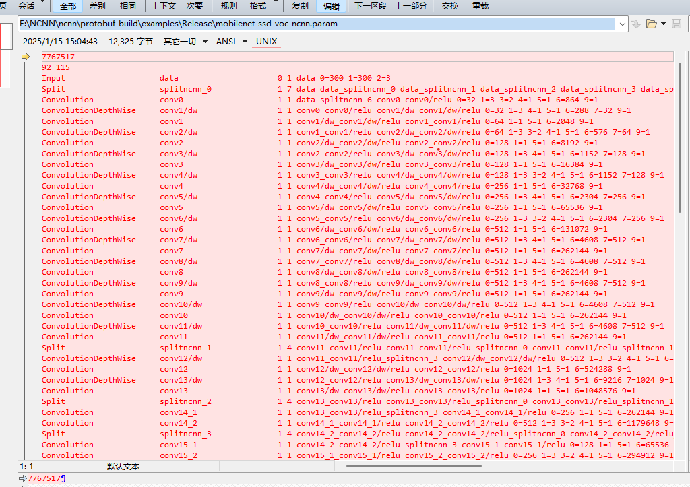
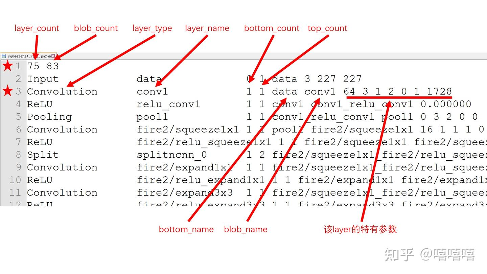

一、【正文】
   
如上图，是模型结构，以param后缀结尾的文件
参照下图，模型层数量92，联接所有层数的blob数115(数据流向blob).
第一列为层数类型（算子类型）-----
第二列为具体的层名（算子具体别称）-----------
第三、四列为bottom_count top_count为该算子上下链接的层.
后续为具体层名的对应关系，bottom_count为该算子是多少大哥的小弟，top_count是下面有多少小弟.----
最后几列数字为Layer参数，以conv0为例 0=32 1=3 3=2 4=1 5=1 6=864 9=1 kernel数量，kernel_size=3 stride=2,padding_size =1,激活类型n,bias_term=,核的数据量：3*3*3*32.
   
   
二、数据结构分析
    结合源码写伪代码
    """

    Net类中含有NetPrivate* const d;
    d中维护了
    # layers列表，存下所有layer
    # blobs列表，背后维护，为find_blob服务
    
    layer_count, blob_count = read(param_file) # 读取第一行数据
    // parse
    int layer_count = 0;
    int blob_count = 0;
    SCAN_VALUE("%d", layer_count)
    SCAN_VALUE("%d", blob_count)
    if (layer_count <= 0 || blob_count <= 0)
    {
        NCNN_LOGE("invalid layer_count or blob_count");
        return -1;
    }

    ############伪代码###############
    for param_file is not EOF: # 循环读取每一行的layer数据
    layer_type, layer_name, bottom_count, top_count = read(param_file) # 读取前四个固定参数
    layer = create_layer(layer_type) # 根据layer类型创建一个layer
    '''create_overwrite_builtin_layer''' 创建内置的层
    '''create_layer_vulkan'''
    '''create_layer_cpu(layer_type)'''
    '''create_custom_layer'''

    for bottom_count:
        bottom_name = read(param_file) # 读取每一个bottom_name
        blob = find_blob(bottom_name) # 查找该blob，没有的话就要新建一个
        '''find_blob_index_by_name'''''''''
        blob.consumers.append(layer) # 当前层是这个blob的消费者，这里的blob是大哥，当前层是小弟，没钱花找大哥要
        layer.bottoms.append(blob) # 记住谁是你的大哥！
    for top_count:
        blob_name= read(param_file) # 读取每一个blob_name
        blob = find_blob(blob_name) # 查找该blob，没有的话就要新建一个
        blob.producer = layer # 当前层是这个blob的生产者，这里的blob是小弟，当前层是大哥，大哥要给小弟们派钱
        layer.tops.append(blob) # 花名册上把小弟名字写一写
    layer.param = read(param_file) # 读取该层的一些特殊参数
    layers.append(layer )

    ###########实际代码#################
    见ncnn源码
    ###########实际代码#################

    """
    流程简单，对与某一层数据来说，首先要认清自己的身份(layer_type),记住谁是你的大哥（bottom_name）,记住谁是你的小弟（blob_name）
    认清自己的斤量（特有参数）

    这个大哥小弟的例子还是我写这个文章的时候无意想到的，觉得很有意思。ncnn推理有一个特点，那就是从底往上递归深搜最短路跑的，这个我觉得用大哥小弟来举例子就很好。这里我先写了怕后面忘了。假定有人给了大哥一笔钱，让他把钱分给小弟(用户调用了input方法塞数据了)，等会会有小弟来要钱(用户调用了extract方法要数据)。这时候大哥有两个方案：1.老老实实给每一个小弟发钱，2.哪个小弟要钱单独给他发。考虑到一个复杂的网络，有很多的大哥、中哥、小哥、大第、中弟、小弟。发钱是一级一级往下发，小弟要钱是一级一级往上要，每一个要钱都是要底下所有人的份子。我们分析一下这两个方案：

方案一：每个人都发，大家都有钱，有些小弟还不需要钱，你也给他发了
优点：每个人你都发了，缺钱也别来问，都给你了（直接完整推理，要什么数据取就行了）
缺点：大哥都发出去了，累死累活的（全部计算量）
方案二：来要钱才给他，有些不要钱的不给了
优点：大哥省事，谁要给谁（节省计算量）
缺点：每个小弟要钱都要往上打报告，大哥再给他们发（取不同节点数据中间需要再推理）
